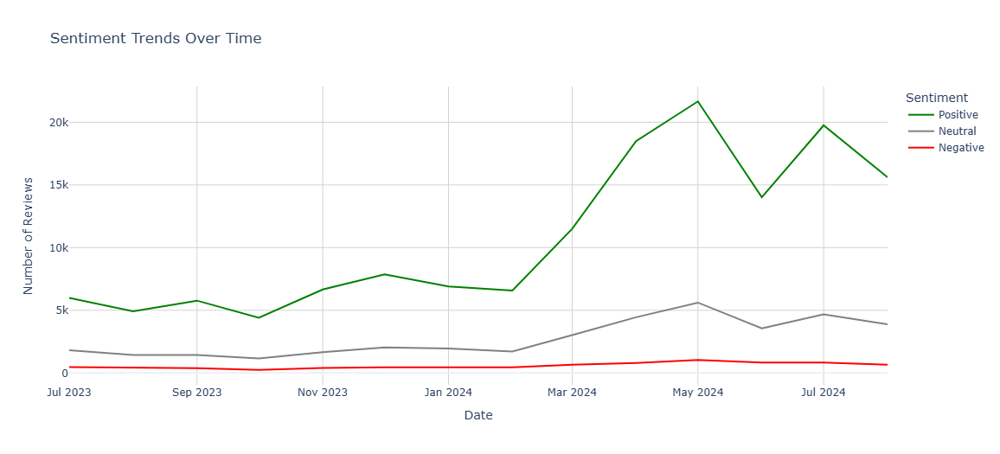

# ChatGPT Reviews Analysis with Python

This project performs sentiment analysis on user reviews of ChatGPT. It explores textual data to extract meaningful insights about user satisfaction, commonly used words, and overall sentiment polarity.

---

## Table of Contents
- [Overview](#overview)
- [Features](#features)
- [Technologies Used](#technologies-used)
- [Installation](#installation)
- [Usage](#usage)
- [Results](#results)
- [License](#license)

---

## Overview

This Python project analyzes a dataset containing real user reviews of ChatGPT. By using Natural Language Processing (NLP) techniques, it performs the following:
- Text preprocessing (lowercasing, punctuation removal, stopword removal, etc.)
- Word cloud generation to visualize frequent terms
- Sentiment analysis using `TextBlob`
- Sentiment classification into Positive, Neutral, and Negative
- Data visualization of sentiment distribution

---

## Dataset
The dataset used contains ChatGPT user reviews, and is available within the notebook or can be downloaded from `data/chatgpt_reviews.csv` for analysis.

---


## Features

- Preprocessing of unstructured text
- Word cloud visualization for exploratory analysis
- Sentiment scoring using TextBlob
- Categorization of reviews into sentiment buckets
- Matplotlib-based bar chart for sentiment comparison

---

## Technologies Used

- Python 
- Pandas 
- Matplotlib 
- WordCloud 
- TextBlob 
- Jupyter Notebook 

---

## Installation

1. **Clone the repository**
   ```bash
   git clone https://github.com/veydantkatyal/chatgpt-reviews-analysis.git
   cd chatgpt-reviews-analysis
   ```
2. **Install required libraries**
    ```bash
   pip install pandas matplotlib wordcloud textblob
   python -m textblob.download_corpora
   ```
---

## Usage
1. **Run the jupyter notebook.**
2. Open the `ChatGPT_Reviews_Analysis.ipynb` notebook.
3. Follow the steps in the notebook to understand analysis and run the desired results

---

## Results


---

## License
The project is licensed under [MIT Licenses](https://github.com/veydantkatyal/gpt-review-analysis/blob/main/LICENSE)
